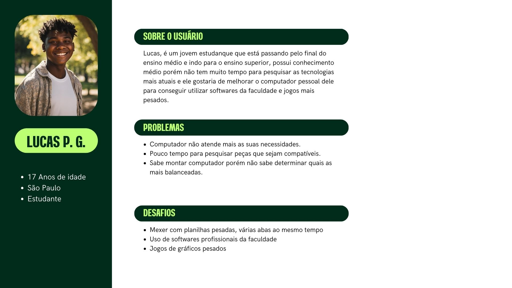

# Projeto Disciplina: Requisitos de Software

Olá! Este repositório faz parte do projeto da disciplina de Requisitos de Software da UTFPR - Campus Cornélio Procópio. 

Link do Padlet: [Clique Aqui](https://padlet.com/pbittencourt1/kanban-v326mjk2snxqv5c6)

## 1. Introdução

***1.1.  (Grupo 7)-2***

[Leonardo Cruz](https://github.com/HiperD) |
[Mathew Cayres](https://github.com/MattCayres) |
[Vinicius Henrique](https://github.com/Vinicius-Henrique1609) |
[Carlos Sert](https://github.com/CarlosSertF) |
[Pedro Bittencourt](https://github.com/pBittencourtS)

***1.2.  Nome do Sistema***

**TechGear**

***1.3.  Propósito do Sistema***

Este documento apresenta os requisitos dos usuários a serem desenvolvidos pela *TechGear*, fornecendo aos desenvolvedores as informações necessárias para o projeto e implementação, assim como para a realização dos testes e homologação do sistema.

Um computador é um sistema complexo composto por várias peças que, juntas, podem ou não trabalhar de uma forma satisfatória para o usuário, porém, comprar um pc, para quem não tem conhecimentos técnicos sobre computação, pode ser um tarefa bastante complicada, tendo em vista a vasta quantidade de peças e combinações que podem ser feitas.  O sistema **TechGear** irá resolver isso, tendo como principal objetivo ajudar qualquer pessoa a comprar ou melhorar um PC, sugerindo a melhor configuração para o seu uso. A sugestão de peças ou configurações completas não será baseada de forma aleatória, mas sim baseada na necessidade da pessoa, como, por exemplo, um pc apenas para trabalho e estudo, ou um pc para jogar jogos (jogos leves? pesados?). O funcionamento do sistema é simples, o usuário instala o software na sua máquina, o software faz uma leitura sobre os componentes presentes no sistema e a sua capacidade de processamento via teste benchmark (de forma automática, com a permissão do usuário), o software então pergunta ao usuário "Para o quê você usará o PC?" e, baseado na resposta, o software então sugere uma configuração de melhor custo benefício para o usuário.

***1.4.  Público Alvo***

O público-alvo do sistema **TechGear** abrange qualquer pessoa interessada em adquirir ou melhorar computadores de forma eficiente, com foco no melhor custo-benefício. O sistema atende, por exemplo, usuários leigos, usuários experientes;

***1.5. Descrição dos usuários***

*<Descrever quais os usuários finais do sistema (quem vai utilizar o sistema). Neste espaço vocês vão traçar um perfil de usuário, bem como as personas e análide de tarefas>*

| **Usuários** | Porcentagem | Faixa Etária | Gênero | Frequência de uso de PC | Nível de conhecimento sobre o hardware de um PC |
| - | - | - | - | - | - |
| **Usuários Leigos** | - | - | - | - | - |
| **Usuários Experientes** | - | - | - | - | - |

***Personas:***

***Análise da situação atual: antes da introdução de sua solução***

*`1. O que as pessoas fazem?`*
*`2. Quais os artefatos envolvidos?`*
*`3. O que elas precisam saber?`*

***Análise das tarefas depois: como serão executadas as suas tarefas com sua solução:***

*`1. O que as pessoas fazem?`*
*`2. Quais os artefatos envolvidos?`*
*`3. O que elas precisam saber?`*

***Cenário: Antes***

*<Preencher com o cenário idealizado antes da aplicação do seu sistema.>*

***Cenário: Depois***

*<Preencher com o cenário idealizado depois da aplicação do seu sistema.>*

## 2. Documentos gerais no repositório

***2.1. Requisitos Funcionais***

| ID | Descrição | Prioridade | Depende de |
| - | - | - | - |
| RF-01 | O sistema deve ser capaz de gerar um relatório sobre o PC do usuário. | Média | RNF-10 |
| RF-02 | O sistema deve ser capaz de verificar a compatibilidade entre os componentes do sistema do usuário. | Alta | - |
| RF-03 | O sistema deve ser capaz de sugerir as melhores combinações de peças para usuário, conforme a sua necessidade e as peças que o mesmo já possui. | Alta | RNF-10, RNF-04 |
| RF-04 | O sistema deve permitir criar uma nova configuração de equipamento. | Alta | RNF-04 |
| RF-05 | O sistema deve armazenar informações sobre os dados dos componentes e sobre os resultados de benchmark. | Alta | - |
| RF-06 | O sistema deve entregar uma visão geral sobre a máquina do usuário, pontos positivos e negativos da sua máquinaa em relação à necessidade do usuário. | Média | - |
| RF-07 | O sistema também deve ser capaz de entender as necessidades do usuário a partir das informações dadas pelo mesmo. | Alta | - |
| RF-08 | O sistema deve possuir um banco de dados online onde deve ser armazenado resultados de benchmark, configurações de peças e seus preços atualizados | Alta | - |
| RF-09 | o sistema deve operar em conjunto com sites de compra de peças de hardware, mostrando os melhores preços e suas respectivas lojas. | Alta | - |

***2.2. Requisitos Não Funcionais***

| ID | Descrição | Prioridade |
| - | - | - |
| RNF-01 | O sistema deve ter uma interface  intuitiva para que todos os usuários, sejam eles experts ou não, consigam utilizar o software. Para isso, as informações úteis ao usuário devem ser exibidas de uma  forma simples, havendo uma forma de explicá-las. | Alta |
| RNF-02 | O software deve ser capaz de realizar os testes de benchmark nas máquinas dos usuários do software a fim facilitar o benchmark de componentes e sistemas de hardwares inteiros,  | Alta |
| RNF-03 | O sistema deve ter uma seção de usuário que pode mostrar suas informações e preferências conforme obtidas no cadastro do mesmo. | Média |
| RNF-04 | O sistema deve manter privadas as informações pessoais de cada usuário. | Alta |
| RNF-05 | O sistema deve funcionar 24 horas. | Alta |
| RNF-06 | O sistema deve ser compatível com os sistemas Android, Ios, Windows e Linux. | Alta |
| RNF-07 | O sistema não deve disponibilizar a função de listagem de peças da máquina se o aplicativo estiver sendo executado em um dispositivo móvel. | Média |
| RNF-08 | O sistema deve possuir os temas claro e escuro  | Baixa |
| RNF-09 | O sistema deve ser inicialmente em português e, posteriormente, deve ser traduzido para inglês  | Alta |
| RNF-10 | As funcionalidades de gerar relatório sobre o pc e a exeução de benchmark não devem ser desenvolvidas para o sistema que rodará em plataformas mobile  | Alta |

***2.3. Perguntas***

*<Arquivo com as perguntas realizadas na entrevista .>*
- **Pergunta 1**:
   - Possível entrevistado: um usuário leigo em computação e um usuário entendido sobre computação;
   - Pergunta: O que você espera de um sistema que lhe ajude a comprar e/ou melhorar o seu PC?
- **Pergunta 2**:
   - Possível entrevistado: ;
   - Pergunta: 
- **Pergunta 3**:
   - Possível entrevistado: ;
   - Pergunta: 
- **Pergunta 4**:
   - Possível entrevistado: ;
   - Pergunta: 
- **Pergunta 5**:
   - Possível entrevistado: ;
   - Pergunta: 
- **Pergunta 6**:
   - Possível entrevistado: ;
   - Pergunta: 
- **Pergunta 7**:
   - Possível entrevistado: ;
   - Pergunta: 
- **Pergunta 8**:
   - Possível entrevistado: ;
   - Pergunta: 
- **Pergunta 9**:
   - Possível entrevistado: ;
   - Pergunta: 
- **Pergunta 10**:
   - Possível entrevistado: ;
   - Pergunta: 
 
     

***2.4. Entrevista***

*<Arquivo com as respostas do indivíduo entrevistado e link do drive com upload da gravação.>*

***2.5. Histórias do Usuário***

*<Imagem, arquivo (PDF), link com as Histórias de Usuário.>*

***2.6. Diagramas de Caso de Uso e Especificações***

*<Imagem, arquivo (PDF), link com Diagrama de Caso de Uso.>*

***2.7. Diagramas de Atividades***

*<Imagem, arquivo (PDF), link com Diagrama de Atividades.>*

***2.8. Matrizes de Rastreabilidade***

*<Imagem, arquivo (PDF), link com Matriz de Rastreabilidade.>*

***2.9. Protótipos***

*<Imagem, arquivo (PDF), link com Protótipo.>*

## Referências

*<Esta seção é destinada à descrição das referências utilizadas pelo documento, como por exemplo, URLs e livros. Ver exemplo a seguir:>*

[1] “Glossário da _USina_”, <_id_doc glossário_>, Versão <_versão_>. Localização: <_localização_>.
